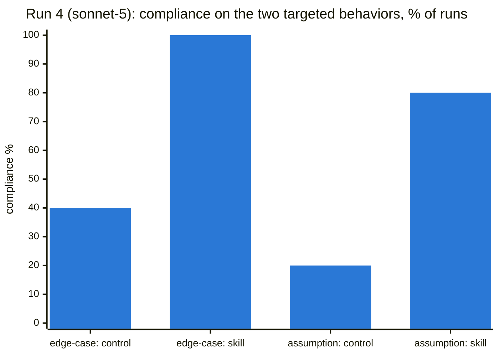
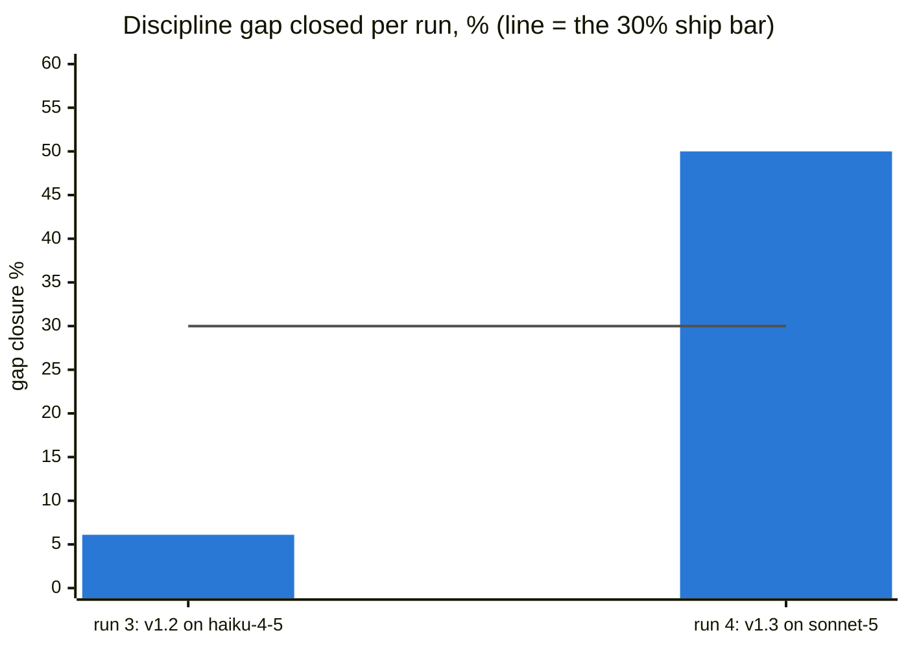

# warmup (free skill) - benchmark results

Named `zeroshot` during runs 1-4 below; renamed to `warmup` on 2026-08-18
(zeroshot is the product, warmup is its free skill). Same file, same content
lineage.

The claim on the can: pouring `skills/warmup/SKILL.md` into a coding agent
improves its working discipline. This page is the evidence, all of it - four
runs, two failures, one invalidated run, and one pass. Method:
[BENCHMARKING.md](../../BENCHMARKING.md).

## The result

**Skill v1.3.0 meets the ship bar on claude-sonnet-5** (2026-08-18, run 4:
17 tasks x 2 arms x 5 trials): task pass rate held exactly (0pp delta, zero
regressions) while the skill closed **50%** of the baseline's blind-graded
discipline gap (pre-registered bar: 30%). The gains landed precisely where
the skill's rules aim:

| Behavior (blind-graded) | Control | Skill v1.3.0 |
|---|---|---|
| Exercised the request's named edge case before declaring done | 40% | **100%** |
| Stated the assumption made on an under-specified choice | 20% | **80%** |
| Pooled compliance, all expectation-bearing tasks | 84.2% | **92.1%** |

Reported with the pass, not hidden under it: the skill costs about +16% per
run (+0.9 turns), one loop incident occurred in 85 skill-arm runs (control:
zero), two tasks scored micro-losses on tiebreaks, and one task's compliance
dipped in the skill arm (feature-batch, 100% to 73%). The result is
model-specific: the same skill measured no meaningful effect on
claude-haiku-4-5. n=5 per arm meets the protocol minimum; replication before
any marketing chart is planned.

## The road to the bar

It took four runs and three skill versions. The discipline metric
(expectation-gap closure) was pre-registered after control-only discovery and
before any skill-arm run on the expanded suite.

| Run | Model | Skill | Verdict | Pass delta | Gap closure |
|---|---|---|---|---|---|
| 1 | claude-haiku-4-5 | v1.0 | **INVALIDATED** - harness bug, skill never in context | - | - |
| 2 | claude-haiku-4-5 | v1.1 | NOT MET | -2.9pp | metric not yet defined |
| 3 | claude-haiku-4-5 | v1.2 | NOT MET | -1.2pp | +6.1% |
| 4 | claude-sonnet-5 | v1.3 | **MET** | 0pp | **+50%** |

What changed between runs, in one line each: run 1 taught us to
canary-verify the harness (the skill was never delivered to context; both
arms were control). Runs 2-3 taught us that politely-worded discipline rules
bind weakly on a small model, even action-shaped ones. v1.3 was rewritten
from evidence - the verbatim rationalizations agents produced in 400+ prior
runs ("All test cases pass", "Both demo samples parse correctly", "will work
once the credential exists") became an explicit rebuttal table, plus a
REQUIRED close template - and tested on a model tier that follows
instructions.

## Published runs

### 2026-08-18 run 4, claude-sonnet-5, skill v1.3.0, 17 tasks x 2 arms x 5 trials

**Ship bar: MET** via the pre-registered discipline clause: pass-rate delta
0pp (zero regressions, first run with none) and blind-graded expectation gap
closure of 50% (bar: 30%; pooled compliance 84.2% to 92.1%). Largest gains
were exactly where the v1.3 rules aimed: edge-case-tested 40% to 100%,
assumption-stated 20% to 80%. Full data:
[benchmark.json](published/2026-08-18-sonnet5-run4/benchmark.json) and
[REPORT.md](published/2026-08-18-sonnet5-run4/REPORT.md).

Reported honestly alongside the pass: the skill costs about +16% per run
(+0.9 turns), one loop incident occurred in 85 skill-arm runs (control: zero),
two tasks scored micro-losses on tiebreaks, and feature-batch expectation
compliance dipped in the skill arm (100% to 73%). One transient-API ghost run
was detected by audit and its task re-run cleanly before this verdict; the
re-run turned an apparent skill win into a tie, and the bar still clears.
This result is model-specific: on claude-haiku-4-5 the same skill measured
no meaningful effect (runs 2-3). n=5 per arm meets the protocol minimum;
replication before marketing claims is recommended and planned.

Method notes: skill v1.3.0 was rewritten from transcript evidence (verbatim
rationalizations from 400+ prior runs became an explicit rebuttal table) after
control-only discovery measured the baseline gaps. The bar metric was
pre-registered before any skill-arm run on this suite.

### 2026-08-18 run 3, claude-haiku-4-5-20251001, 17 tasks x 2 arms x 5 trials

**Ship bar: NOT MET.** Skill v1.2.0 on the expanded 17-task suite with the
pre-registered expectation-gap metric: pass delta -1.2pp (one recurring
skill-arm failure on plan-then-build), expectation gap closure +6.1% (bar:
30%), win/loss/tie 0/1/16, overhead +0.6 turns per run (down from +1.35 in
run 2). Full data: [benchmark.json](published/2026-08-18-haiku45-run3/benchmark.json)
and [REPORT.md](published/2026-08-18-haiku45-run3/REPORT.md).

Honest read: even action-shaped system-prompt rules bind weakly on this model
during agentic work. The two rules written directly against measured 0%
baseline gaps moved compliance by at most one run in five (assumption-stated
0/5 to 1/5; edge-case-tested went 2/5 to 1/5). Two genuine small wins
(frozen-file discipline 3/5 to 5/5, evidence-before-edit 4/5 to 5/5) do not
clear the bar. Conclusion after three runs: a generic discipline preset has
hit its measurable ceiling on claude-haiku-4-5.

### 2026-08-18 run 2, claude-haiku-4-5-20251001, 8 tasks x 2 arms x 5 trials

**Ship bar: NOT MET. The skill is a net negative on this suite and model.**
Pass delta -2.9pp; win/loss/tie 0/2/6; the skill added +1.35 turns and about
+21% cost per run with no measurable behavioral gain. First valid run (skill
injection canary-verified). Full data:
[benchmark.json](published/2026-08-18-haiku45-run2/benchmark.json) and
[REPORT.md](published/2026-08-18-haiku45-run2/REPORT.md).

Honest read: the baseline model already exhibits the behaviors the skill
teaches (5/5 bounded attempts, 5/5 no fabrication, zero loop incidents even in
the hardened trap), so the skill's generic discipline buys nothing here and
its overhead is real.

### 2026-08-18 run 1, claude-haiku-4-5-20251001 - INVALIDATED

**This run measured nothing and is kept only for transparency.** A harness bug
meant the skill arm never received the skill: the executor installed SKILL.md
as a workspace file but excluded the Skill tool from the agent's allowed
tools, so the skill was never activated and never entered context. Transcript
audit confirmed zero skill activations across all 40 skill-arm runs. Both arms
were effectively control. The apparent +2.9pp delta, one win, and one loss
were noise. Data preserved unchanged in
[published/2026-08-18-haiku45/](published/2026-08-18-haiku45/).

The fix: the executor now injects the skill body via the agent's system prompt
(verified with an action canary present in the skill arm and absent from
control), so arms differ only by that content.

## Policy

Results land here only from real benchmark runs: named model version, 5+ trials
per arm, all runs included. Dry runs never land here. Improvement claims
require the ship bar: pass-rate delta of at least +15 points, or a held pass
rate with 30%+ improvement on discipline metrics, across 5+ runs per arm.
Until a run clears it: no chart, no claim.
